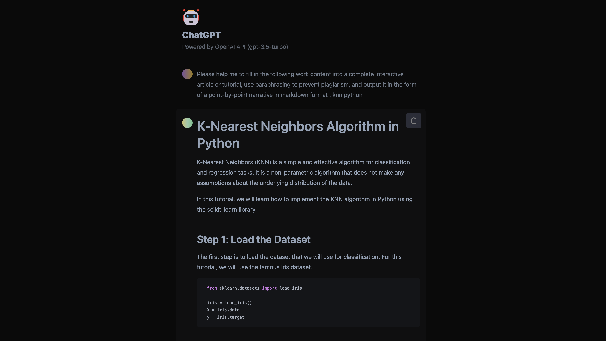

# ChatGPT-API Vercel



Translated from [ourongxing/chatgpt-vercel](https://github.com/ourongxing/chatgpt-vercel) and Enhanced functionality for [diu8081/chatgpt-demo](https://github.com/ddiu8081/chatgpt-demo).

Preview: [https://fiqgpt.vercel.app/](https://fiqgpt.vercel.app/)

## Deploy your own (for free)

If you only need to deploy a website for your own use and do not need customization, then you do not need to run it locally. You can click the button below and follow the prompts to complete the deployment. The Vercel domain has been blocked, so you need to bind your own domain name.

[](https://vercel.com/new/clone?repository-url=https://github.com/fiqgant/fiqgpt3.5)

If you need to deploy it for more people to use, you may need to `git clone` the repository you created above to your local machine.

1. Rename the `.env.example` file to `.env`, and fill in your [OpenAI API key](https://platform.openai.com/account/api-keys) in it. If the user does not fill in their own key, then your key will be used, so you need to fill in your key here.

    ```ts
    OPENAI_API_KEY=sk-xxx...
    // You can fill in multiple ones, separated by |, and call them randomly
    OPENAI_API_KEY=sk-xxx|sk-yyy
    ```

2. In the previous version, I set the `Enable Continuous Conversation` option to be reset every time the page is refreshed, because this feature is generally not needed and is more expensive. In the current version, I have removed this feature. If you need to use it for more people, it is recommended to enable it. Just uncomment [this line of code](https://github.com/fiqgant/fiqgpt3.5/blob/main/src/components/Generator.tsx#LL53C10-L53C39).
3. `git commit & push` to redeploy, you can do it in a few clicks on vscode.

## API

### POST /api

```ts
await fetch("/api", {
    method: "POST",
    body: JSON.stringify({
        message: "xxx",
        key: "xxxx"
    })
})
```

## License

MIT